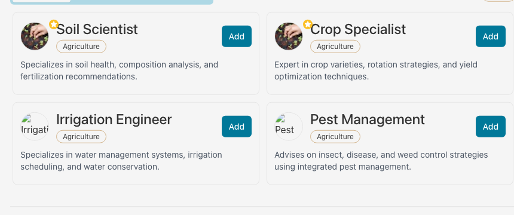
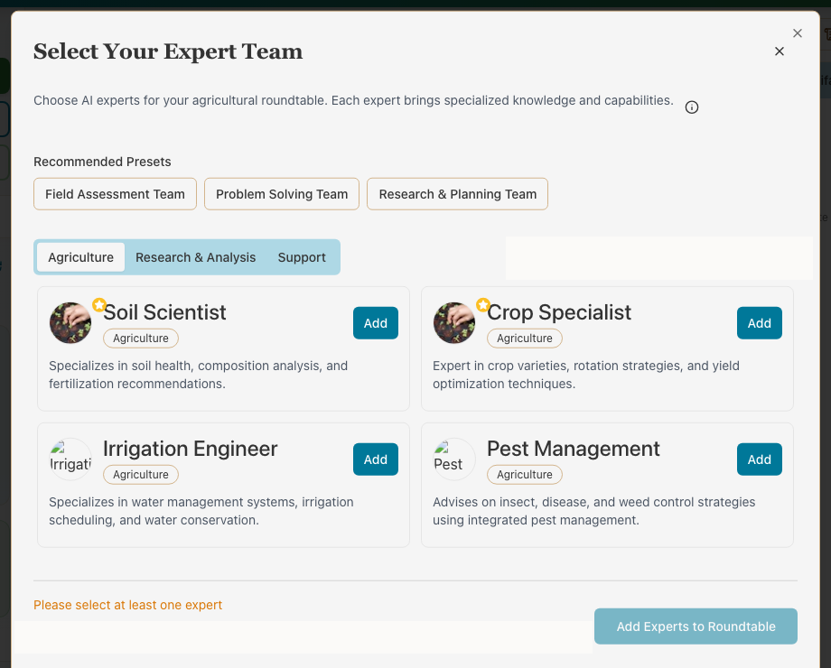

<p align="center">
  
</p>

# FarmFriend Roundtable

The answer is advice. It is not a reading from your field.

You pick who sits at the table. A soil scientist, a crop person, an irrigation engineer. They have not walked the place.



You choose the seats. Then you ask about soil, water, pests, or the crop in the ground. The answer is advice. It is not a reading from your field.

## What you can do

- Seat a soil scientist, a crop specialist, an irrigation engineer, or pest management.
- Start from a field team, a problem-solving team, or a planning team.
- Keep the talk, and export it.

## What it will not do

- It will not water, spray, or switch a pump.
- It will not tell you the answer is a measurement. If you did not walk the field, neither did it.

## Run it

You need [Node.js](https://nodejs.org) 20 or newer. The full machine setup, including the database, is in [README-SELF-HOST.md](README-SELF-HOST.md).

```sh
git clone https://github.com/0-CYBERDYNE-SYSTEMS-0/ff-roundtable.git
cd ff-roundtable
npm install
npm run dev
```

Open the address it prints.

## License

[MIT](LICENSE).

## For people changing the code

Community rules are in [CONTRIBUTING.md](CONTRIBUTING.md) if that file is present, and security reports go to the maintainer. The app is a web page plus a small server. Setup details stay in the self-host guide.

## Quick Start

```bash
npm install
npm run dev
```

## Tech Stack

- React 18 + Vite + TypeScript
- Express + WebSocket
- PostgreSQL + Drizzle ORM
- Tailwind CSS + shadcn/ui
- Stripe subscriptions
- OpenRouter AI integration
